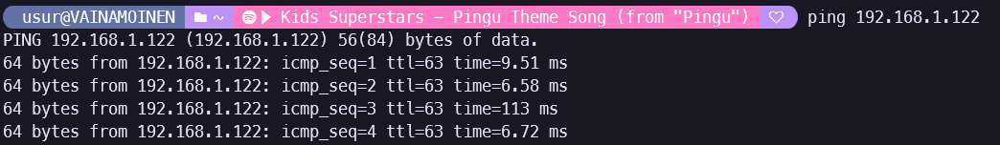

# Week 1

## 1. Browse this [Linux Command Line Primer](https://www.digitalocean.com/community/tutorials/a-linux-command-line-primer)
	> Done

## 2. Describe following commands and concepts:

- man, apropos
> man provides way to read program and system manuals. Apropos can be used to search short descriptions of those manual pages for word or regular expression. man can provide very similar functionality with  `-k` or `-K` arguments
- man date
> returns manual page for date program that can be used to set system time or print it out with variety of formatting options.
  
- ls
> ls lists files and folders in path provided to it or current folder if it's not provided. Has huge number of options for showing more info or formatting it differently. Perhaps most interesting or useful is `-a` to show hidden files (those that start with .), `-l` toE print more info on listed files.

- ls --help
>  ls --help provides help page for ls program. This is largely same info that is available through man, although lacks some sections.
 
- date
> program to set and access system time. Prints time in localized format when opened without any arguments. Note: 'la'  comes from system time format, even when system language is English.
>  ```sh
> la 9.11.2024 12.53.55 +0200
>  ```
    
- date --help
> Prints out help page for previously mentioned date program, including many formatting options.
- cd
> cd is program that changes current working directory (pwd) to one provided as argument. When no argument is given, it changes to home directory defined in $HOME environment variable if available.
    
- cd -
> Changes pwd to previous pwd, stored in environment variable $OLDPWD
    
- cd ..
> Moves to current pwd's parent folder
 
- ls -lat
> This combines three optional flags for ls -command. -l shows all files and folders on their own lines with additional info, such as read/write/execution rights, owner, group and creation date. -a show also hidden files (those with name starting with dot). -t orders files in order of creation date, newest first.
- ls -s aaaa*
> -s adds size data to normal file/directory list, size is in blocks on my system 1 block = 1024 bytes and it seems they are reserved for files in chunks of 4. `aaaa*` specifies file name where * is wild card.
>  ```sh
> :$ ls -l
> total 20
> -rw-r--r-- 1 atte atte    47  9.11. 19:32 aaaaa
> -rw-r--r-- 1 atte atte 13753  9.11. 19:34 aaaab
> ~/temp ls -s aaaa*
> 4 aaaaa  16 aaaab
>   ```
 
- pwd
> pwd prints current working directory. Has only two options, -P (default) prints physical path from root avoiding symlinks, -L prints path directly from environment variable $PWD, even if it contains symlinks
	
- chown
> Allows changing of owner of the file and/or it's group.
 
- chmod
>  Change permissions to file or directory. Permissions can be modified for owner, group and others. All those can have any combination of following: Read, write and/or execute, although some of the possible combinations don't make much sense.
- chgrp
> Changes group of the given file or folder.  Can be done recursively with -R 

- chmod 644 file
> Changes permissions for file or folder named file to following:
> Owner: Read and write,
> Group: Read
> Others: Read
	
- chmod g+x myfile
> Adds execution rights for group on file `myfile`
    
- rm
> General removal utility. Removes file provided as argument. By default, doesn't remove folders.

   rm -r mydoc
> Removes folder `mydoc` if it's empty

- cp primary secondary
>  Copies file `primary` to file `secondary`

- mv file2 file1
> moves `file2` to location `file1`. In practice, as presented it renames a file.
- mkdir mydata
> Creates a directory `mydata`

- rmdir mydata
> removes directory `mydata` but only if it is empty.

- more, less
> Both programs allow easy reading of text files. As per documentation of more: "less provides more emulation plus extensive enhancements". According to manual for man, it also uses less by default if available.

- file
> Tries to classify file given as an argument. Example below it recognizes text file with correctly formatted JSON even with wrong extension.
>  ```
> itsMe:~$ file enOleTarTiedosto.tar
> enOleTarTiedosto.tar: JSON data
>  ```

- stat
>  ```sh
> :~$ stat enOleTarTiedosto.tar
> File: enOleTarTiedosto.tar
> Size: 21              Blocks: 8          IO Block: 4096   regular file
> Device: 830h/2096d      Inode: 3678        Links: 1
> Access: (0644/-rw-r--r--)  Uid: ( 1000/    usur)   Gid: ( 1000/    usur)
> Access: 2024-11-18 20:12:36.838682373 +0200
> Modify: 2024-11-18 20:10:34.988694611 +0200
> Change: 2024-11-18 20:12:31.168682931 +0200
>  Birth: 2024-11-18 20:07:11.528715159 +0200
>  ```

- df
> Displays disk usage. Example below is not normal for linux, but typical for WSL installation.
>  ```sh
> :~$ df
> Filesystem      1K-blocks      Used Available Use% Mounted on
> none              8165976         0   8165976   0% /usr/lib/modules/5.15.167.4-microsoft-standard-WSL2
> none              8165976         4   8165972   1% /mnt/wsl
> drivers         975663672 915308860  60354812  94% /usr/lib/wsl/drivers
> /dev/sdd       1055762868  34458116 967601280   4% /
> none              8165976       104   8165872   1% /mnt/wslg
> none              8165976         0   8165976   0% /usr/lib/wsl/lib
> rootfs            8162564      2208   8160356   1% /init
> none              8165976         0   8165976   0% /run
> none              8165976         0   8165976   0% /run/lock
> none              8165976         0   8165976   0% /run/shm
> none              8165976         0   8165976   0% /run/user
> tmpfs             8165976         0   8165976   0% /sys/fs/cgroup
> none              8165976        76   8165900   1% /mnt/wslg/versions.txt
> none              8165976        76   8165900   1% /mnt/wslg/doc
> C:\             975663672 915308860  60354812  94% /mnt/c
> D:\              52428800  11743664  40685136  23% /mnt/d
>  ```

   ln
> creates a link to file or folder. In example below, it creates link `shortcut` to folder `hello/second/`
>  ```sh
> :~$ ln -s hello/second/ shortcut
> :~$ ls -l
> total 12
> drwxr-xr-x 3 usur usur 4096 Nov 18 20:31 hello
> drwxr-xr-x 2 usur usur 4096 Aug 17 20:30 models
> lrwxrwxrwx 1 usur usur   13 Nov 18 21:43 shortcut -> hello/second/

- which, whereis
> which tells path to executable, can show path to it's manual and source too. Whereis provides them all as default.

- find
> Allows searching for files with many different criteria such size, name, permissions... Returns paths to files 

- touch
> Updates time of access and modification to current time (default). As default, creates empty file of that name if it doesn't exist.

- touch mynewfile
> Changes files access and update time to current time, if it doesn't exist, it is created.
- cp /tmp/test.txt ~/temp/
> Copies file `test.txt` from folder `/tmp/` to folder ~/temp/

## 3. What is the difference between Linux kernel and GNU/Linux distribution?
> Despite Linux usually used to refer to full operating system, it is more presicely only the kernel (the core of the system). GNU is older attempt to create totally free (financially and otherwise) operating system that has not materialized. It has however, managed to build huge number of software needed for OS, many of them are in section 2 (scroll man page to end, many of them include `GNU coreutils 8.32` or similar). 
> GNU/Linux is the result of using Linux kernel and GNU programs to build full operating system. Although that is usually what happens in Linux distributions, it doesn't need to be. Other operating systems can be built on Linux kernel with minimal or nonexistant need of GNU project software. Examples being Alpine linux and Android.

## 4. Name some very common Linux distributions
> Ubuntu, Mint, Arch, Debian

## 5. What is GPLv2/v3 license? And BSD style license?
> GPL licences allow users to freely use and modify provided software as long as that modification is then shared with same license, including the source code. It does allow for commerial use as long as work or it's derivatives are licenced with GPL.
> BSD is much less restrictive than GPL. It allows those modifications to be close sourced even when used for commercial use. In practice, it only requires requires acknowledgement/creditation of the original author. There 3 clause version, that prohibits the use of name of project or its authors for endorcement without permission.

## 6. What is (operating system) shell?
> Shell is a program that allows users to interact with operating system to manage their computer/operating system. They can be command line or graphical in nature although the word shell is usually associated with CLI. As they are just a specialized program, there is often possibility to change shell on many operating systems or specialized versions, such as remote shell.

## 7. What are case sensitive file names?
> Most operating system use case sensitive file naming, meaning files and directories with different character cases are distinct names. For example, file `file.txt` and `File.txt` are separete files and can be distinguished. This is in contrast with *case insensitive* as is used in Windows. In previously mentioned files Windows would not allow those files to coexist in same folder.

## 8. Describe common purpose of files and directories in “/home”, “/etc”, “/usr/bin” and “/var”
> */home* contains folder for each user on the system. This is the location where shell usually starts at (also referred as ~).
> */etc* contains configuration files for multitude of programs. Many of these meant to be user modified to change how programs work.
> */usr/bin* contains programs not directly assosiated with operating system or administrator (those are in */bin* and */sbin*) but those intended for end user to use.
> */var* is bit less intuitive. It is meant for data that changes as system is used. It can contain files of hugely different types that are meant to change frequently or live for unspecified time. There are directories for mail boxes (in and out), printer queue, games, temporary files, log files and many more.

## 9. What is shell PATH? What is the difference between absolute and relative path?
> PATH is environment variable with list of *absolute paths* to folders with executable files. When user tries to start program ex. `ls` or `python`, the shell starts to look for that file from paths listed in PATH. Below is example of PATH from my WSL system, formatted for easier reading.
> ```bash
> usur@VAINAMOINEN:~$ echo $PATH 
> /usr/local/sbin:
> /usr/local/bin:
> /usr/sbin:
> /usr/bin: # <- ls found here
> /sbin:
> /bin:
> /usr/games:
> /usr/local/games:
> /usr/lib/wsl/lib:
> /mnt/c/Python311/Scripts/:
> /mnt/c/Python311/:	# <- python.exe found here
> /mnt/c/WINDOWS/system32:
> /mnt/c/WINDOWS:
> /mnt/c/WINDOWS/System32/Wbem:
> /mnt/c/WINDOWS/System32/WindowsPowerShell/v1.0/:
> /mnt/c/WINDOWS/System32/OpenSSH/:
> /mnt/c/ProgramData/chocolatey/bin:
> /mnt/c/Program Files (x86)/Windows Kits/10/Windows Performance Toolkit/:
> /mnt/c/Program Files (x86)/NVIDIA Corporation/PhysX/Common:
> /mnt/c/Program Files/dotnet/:
> /mnt/c/Program Files/Git/cmd:
> /mnt/c/Program Files/nodejs/:
> /mnt/c/Program Files/PuTTY/:
> /Docker/host/bin:
> /mnt/c/Program Files/Arduino CLI/:
> /mnt/c/Program Files/PowerShell/7/:
> /mnt/d/packages/cargo/bin:
> /mnt/c/Users/<winusername censored>/AppData/Local/Programs/Python/Launcher/:
> /mnt/c/Program Files (x86)/Arm GNU Toolchain arm-none-eabi/13.2 Rel1/bin:
> /mnt/c/Program Files (x86)/Arm GNU Toolchain arm-none-eabi/12.3 rel1/bin:
> /mnt/c/Program Files (x86)/GNU Arm Embedded Toolchain/10 2021.10/bin:
> /mnt/c/Users/<winusername censored>/.cargo/bin:
> /mnt/c/Users/<winusername censored>/AppData/Local/Microsoft/WindowsApps:
> /mnt/c/Users/<winusername censored>/AppData/Local/Programs/oh-my-posh/bin:
> /mnt/c/Users/<winusername censored>/AppData/Local/Programs/Microsoft VS Code/bin:
> /mnt/c/Users/<winusername censored>/AppData/Local/GitHubDesktop/bin:
> /mnt/c/msys64/ucrt64/bin:
> /mnt/c/Users/<winusername censored>/AppData/Roaming/npm:
> /mnt/c/Users/<winusername censored>/.dotnet/tools:
> /mnt/c/Users/<winusername censored>/.fly/bin:
> /snap/bin
> # program 'python' has not been installed on this os, so it was not found.
>  ```
> Interesingly, WSL installation includes paths from Windows too and allows starting programs installed on windows, such as `python.exe` or `putty.exe`.

## 10. What is the purpose of tilde character (~) for most Linux shells. For example ls ~/
> ~ refers to current user's home directory so ~ is shorthand for `/home/<current users name>`
  
## 11. How do you recognise a hidden file in any common Unix/Linux file systems?
> Hidden files have . at the start of their names.
  
## 12. What is the meaning of “piping data between commands”?
> Piping allows passing one programs output to other programs input. For example, we could list all files with `ls -la` and use grep to find lines with `vscode` in them.
> ```bash
> usur@VAINAMOINEN:~$ ls -la | grep -i vscode
> drwxr-xr-x 4 usur usur 4096 May  8  2023 .vscode-remote-containers
> drwxr-xr-x 5 usur usur 4096 Nov 18 20:07 .vscode-server
>  ```
  
## 13. What are seti-uid (suid) and set-gid (sgid) bits for file permissions?
> Suid and Sgid allow setting permissions to files to make them run with permissions of owner/owners group. This allows users to run specific programs as if they had permissions of owner (such as root) or their group. This poses a security risk if handled poorly, but is necessary for many things. One such thing is password management. Below example of how suid looks like in UI.
> ```bash
> usur@VAINAMOINEN:~$ ls -la | grep Suid
> -rwsrw-rw- 1 usur usur    0 Dec  1 12:11 fileWithSuid # s replaces x in human readable form
> -rwxrw-rw- 1 usur usur    0 Dec  1 12:11 fileWithoutSuid
> usur@VAINAMOINEN:~$ stat -c "%a %n" * | grep Suid
> 4766 fileWithSuid # <- 4 signifies suid bit
> 766 fileWithoutSuid
> ```

## 14. What is a “sticky-bit”?
> Sticky-bit makes files unremovable for non-owner users that have write access to file or folder. Especially useful for folders that should not be deleted but where users need write access.
  
## 15. Use manual pages and explain what will command “uname -a” do?
> `uname` prints system information, -a gives all information.
  
## 16. Use manual pages and explain what will command “wc -l” do?
> `wc -l` prints out *new lines* in the file provided as argument.
  
## 17. Linux file handling intro:
    - List five largest files in /usr/lib -directory (Tip: Use ls command with proper command line options)
> TODO
  
    - What is the group for /bin/ls file?
    - How do you change file or directory owner and group?
    - How do you change file permissions so that file user has all access rights (read, write and execute), group and others have none?
    - How do you change file permissions so that file user has read and write access (no execute), group and others have only read access?
    - How do you change file permissions so that file user, group and others have only read and execute (no write) access?
    - Describe following file permissions and ownership:  
        **drwxr-x--- 2 teemu root 4096 Jul 2 2002 webalizer**
    - Create directory “exercise1” under you home directory
    - Create empty file (length 0 bytes) “qwerty.txt” to that directory
    - Rename directory “exercise1” to “exer2”?
    - Change file qwerty.txt file permissions so that only you (the owner) has a read access to it and nothing else
    - Create symbolic link to you home directory “this_is_my_link” and make it point to the exer2-directory
    - How can you find out your current directory location and PATH? How far (in directories) are you from the file system root (/)?
## 18. Remove files and directories which you created on this exercise

**Extra assignments (No need to answer to the learning diary. Ignore for grading):**

- Install Ubuntu Linux (or whatever Linux distribution you prefer) to VMware, VirtualBox, Hyper-V or KVM (or use Windows 10/11 WSL/WSL2). You can skip this if you are already using personal Linux desktop(s) or server from Oamk. Note: Virtualbox may have some compatibility issues with WSL2
- Install Apache web server to your Linux server and code some very basic web page with text editor such as Nano, Vim or Emacs

# Week 2

## 18. Watch some [live coding Twitch streams](https://www.twitch.tv/directory/category/software-and-game-development), select one and answer:
-	What is the programming language/languages used?
> Typescript
- Which programming libraries and frameworks are being used?
> Sveltekit
- What is the code editor / IDE being used?
> VSCode

## 19. If you have a Windows host:
- Install the Cmder and Winscp
- Try common file commands with Cmder (commands like ls, cd, mkdir, Bash shell etc)
> Tried. Failed to see much benefit over powershell with commands like that.
- Use Winscp to move some files between the Windows and Linux hosts
> I used winSCP to send text file from my windows PC to Raspberry Pi
> 
> 


## 20.  Study and explain shortly following commands and concepts:
- zip, unzip
> Allows packing and compressing files and folders to single .zip -file. Unzip is used to decompress and unpack them.
- tar
> tar bundles several files and folders into one .tar -file called tarball.
- gzip
> Much like `zip/unzip` but from GNU projecy
- xz
> Widely used compression utility with better compression ratio compared to alternatives.
- zcat, zgrep
> `zcat` allows printing file contents of gzip files. `zgrep` unpacks specified compressed file and passes it to `grep` with paramenters provided to `zgrep`
- compress
> No compress found on my distros, nor could I find with google what this might be asking for... (TODO?)
- bzip2
> Yet another compression tool, using different algorithm.
- 7z
> Is archive file format that allows users to select used compression method.
- ldd
> `ldd` prints out shared libraries used by the specified program. Below is example for program *nano*:
> ```bash
> usur@VAINAMOINEN:/usr/bin$ ldd nano
>    linux-vdso.so.1 (0x00007ffe6cdfe000)
>    libncursesw.so.6 => /lib/x86_64-linux-gnu/libncursesw.so.6 (0x00007fcc1748f000)
>    libtinfo.so.6 => /lib/x86_64-linux-gnu/libtinfo.so.6 (0x00007fcc1745d000)
>    libc.so.6 => /lib/x86_64-linux-gnu/libc.so.6 (0x00007fcc17234000)
>    /lib64/ld-linux-x86-64.so.2 (0x00007fcc1751b000)
> ```
- GNU gcc / g++
> GNU projects c and c++ compilers.

## 21.  Install build-essential meta package (containing development tools) to your server with: sudo apt install build-essential
> Done
> ```bash
> usur@VAINAMOINEN:/usr/bin$ sudo apt install build-essential
> [sudo] password for usur:
> Reading package lists... Done
> Building dependency tree... Done
> Reading state information... Done
> build-essential is already the newest version (12.9ubuntu3).
> build-essential set to manually installed.
> 0 upgraded, 0 newly installed, 0 to remove and 141 not upgraded.
> ```
  
## 22.  Get the source code for curses-based (“text-graphics”) worm game [nibbles-1.2.tar.gz](https://tl.oamk.fi/cdos/dl/nibbles-1.2.tar.gz)
- Unpack the source package to a some temporary directory under your home directory
- Compile the game and try playing it. Note: Ubuntu does not have ncursed development libraries installed by default. Use apt install to install the missing library dependencies: sudo apt install libncurses-dev
> After installing libncurses-dev and unpacking:
>
> ```bash
> usur@VAINAMOINEN:~/nibbles/nibbles-1.2$ make
> gcc -O2 -Wall -c -o main.o main.c
> main.c: In function ‘main’:
> main.c:54:9: warning: implicit declaration of function ‘memset’ [-Wimplicit-function-declaration]
>    54 |         memset(grid,0,sizeof(grid));
>       |         ^~~~~~
> main.c:11:1: note: include ‘<string.h>’ or provide a declaration of ‘memset’
>    10 | #include "screen.h"
>   +++ |+#include <string.h>
>    11 |
> screen.c:46:17: note: include ‘<stdlib.h>’ or provide a declaration of ‘exit’
> # And lots more warings....
> gcc -O2 -Wall -o nibbles main.o misc.o screen.o -lncurses
> usur@VAINAMOINEN:~/nibbles/nibbles-1.2$ ls
> CHANGES  Makefile  README  config.h  main.c  main.o  misc.c  misc.h  misc.o  nibbles  screen.c  screen.h  screen.o
> usur@VAINAMOINEN:~/nibbles/nibbles-1.2$ ./nibbles
> You crashed in a wall. Your score was 1.
> usur@VAINAMOINEN:~/nibbles/nibbles-1.2$
> ```

## 23.    Get the source code for another curses-based (“text-graphics”) Tetris game [nct-1.4.tar.gz](https://tl.oamk.fi/cdos/dl/nct-1.4.tar.gz)
   - Unpack source package to temporary directory in your home directory.
   > ```bash
   > usur@VAINAMOINEN:~$ mkdir tetris
   > usur@VAINAMOINEN:~$ cd tetris/
   > usur@VAINAMOINEN:~/tetris$ wget https://tl.oamk.fi/cdos/dl/nct-1.4.tar.gz
   > --2024-12-06 13:03:45--  https://tl.oamk.fi/cdos/dl/nct-1.4.tar.gz
   > Resolving tl.oamk.fi (tl.oamk.fi)... 37.27.176.253
   > Connecting to tl.oamk.fi (tl.oamk.fi)|37.27.176.253|:443... connected.
   > HTTP request sent, awaiting response... 200 OK
   > Length: 44562 (44K) [application/x-gzip]
   > Saving to: ‘nct-1.4.tar.gz’
   > 
   > nct-1.4.tar.gz                100%[=================================================>]  43.52K  --.-KB/s    in 0.04s
   > 
   > 2024-12-06 13:03:46 (991 KB/s) - ‘nct-1.4.tar.gz’ saved [44562/44562]
   > 
   > usur@VAINAMOINEN:~/tetris$ ls
   > nct-1.4.tar.gz
   > usur@VAINAMOINEN:~/tetris$ tar -xf archive.tar.gz
   > tar: archive.tar.gz: Cannot open: No such file or directory
   > tar: Error is not recoverable: exiting now
   > usur@VAINAMOINEN:~/tetris$ tar -xf nct-1.4.tar.gz
   > usur@VAINAMOINEN:~/tetris$ ls
   > nct-1.4  nct-1.4.tar.gz
   > usur@VAINAMOINEN:~/tetris$
   > ```
   - Use source package’s configure script to generate Makefile with installation prefix pointing to your home directory
   > 
   - Compile source code and install compiled files
   - Test if game works
   - Remove temporary game directory

## 24.  Download the file harj_zip_paketti.zip. Zip-package has following hierarchy:

    ```paahakemisto
          hakemisto_a
                karate_kat.jpg
                lazy.jpg

          hakemisto_b
                etherkill.jpg

          jap-inv3.jpg
          tekstia.txt
	```
   > 


## 25.  With the ZIP file:
- Unpack package and all subdirectories to a temporary directory in your home directory
   > 
   > 
- Create tar archive from unpacked files and directories and name it to a paketti.tar
   > 
- List contents of the paketti.tar. If everything is correct, delete paahakemisto directory and all subdirectories under it. Delete also the harj_zip_paketti.zip file. Don’t delete the paketti.tar -file you just created.
   > 
- Unpack only the etherkill.jpg file from tar archive.
   > 
- Compress paketti.tar archive with a gzip command.
   > 
- What is the size of paketti.tar.gz now?
   > 263KB
- Uncompress paketti.tar.gz and compress it again, but now with bzip2. Check the size again. Any difference?
   > 
- Create some gzipped tar archive and use SSH (scp) to copy it to the students.oamk.fi (students.oamk.fi is a Linux server you can use with your Oamk user account credentials)

## 26.  Compile this C source code with gcc and check if it works. helloworld.c source code:
```cpp
#include <stdio.h>
int main(void) {
	printf("Hello, world!\n");
		return 0;
}
```
   > 

## 27.  Compile this C++ source code with g++ and test it. helloworld.cpp source code:

```cpp
#include <iostream>

using namespace std;
int main()
{
	cout << "Hello World!\n";
}
```
   > 


## 28.  With previously compiled helloworld C++ binary:
- What are statically linked libraries? Why would you use them?
   > When using statically linked libraries those are included into the output binary. This eases use and deployment as all the libraries needed for running the program are shipped with executable.
- Inspect the size of ready binary file (that compiled helloworld binary). Compile it again and use some different output filename. With g++, use now statically linked libraries (with compiler’s -static parameter). Compare the file sizes of statically and dynamically linked binaries
   > 
   > Size difference is quite significant in executable of this size

- Use strace to inspect interiors (system calls) of ls command: “strace ls” and compare the output to a “strace chmod”. Check _exit -values. Why chmod returns 1  and ls returns 0? 
   > exit values signal program's success or lack thereof to caller. Caller can be shell or other program. By convention, 0 means success, while all else are considered failure. Many manuals list possible exit codes and their meaning.
   > ls returns one, as it works with just ls command. Chmod fails as it doesn't get arguments it needs to run.
   > Many shells provide visual cue on success/failure. Note, prompt always shows success/failure of last command. Below is example on mine:
   > 

- Why and when Unix administrators and programmers use system call tracing programs and debuggers such as gdb and strace?
   > `strace` allows user to see what calls program make for operating system. This can be valuable when has problems that might be result of needed dependencies. This can be missing dynamic libraries, permissions or network requests.
   > `gdb` and similar debugging tools are more suitable when suspected problem is in the program itself. `gdb` execution step by step, visibility to program's variables and investigation of crash reports.

## 29.  Solve these service management assignments (Note: most assignments will require root access):
- Check what network adapters your Linux host/server has with command: ip addr or ifconfig (ifconfig is not necessary installed by default)
   > 
   
- Listen inbound ICMP traffic in your server with tcpdump command line protocol analyzer and test if you can see the traffic when you ping your server: tcpdump -n -i YOUR_NETWORK_ADAPTER_NAME_HERE icmp
   > Connected to Raspberry Pi and pinged that.
   > 
   > 

- Install apache web server with apt install apache2 and test that you can access your server with a web browser
   > TODO

- Listen TCP/80 (web) traffic in your server with tcpdump and test if you can see the inbound TCP SYN segments after you try to access your server with a web browser: tcpdump -n -i YOUR_NETWORK_ADAPTER_NAME_HERE tcp port 80
- Explain what is runlevel?
  > Runlevels describe how many features are used. They can be used to signal how operating system should be started. In normal operation levels 3 and 5 would be most likely in standard Linux specification. Level 3 would include multi-user with networking and level 5 with addition of display manager.
  > Lower levels can be used when doing administrative tasks or when solving problems with start up. Similar to Safe mode in Windows.

- Explain what is systemd?
  > `systemd` is system and service manager for Linux. It has largely replaced older alternatives with more limited features.
  > It handles many aspects of system. Systemd is responsible for starting services on system startup in correct order to satisfy their dependencies. It allows users to add their own timed services (cron alternative).

- Explain what are the files in /etc/init.d/ directory?
   > `init.d` is first service that runs on system start up and it is responsible for running other start up services. Files in the folder are start up scripts for those services, such as _apparmour_ (below). All start up scripts have special section that tells `init.d` multitude of things it needs or when it should be run. _Required-Start_ tell what service should be available before starting this service and _Required-Stop_ lists services whose shutdown will 
   > 
- Study but don’t do: What is runlevel 6? What is the purpose of init 6 command? How would you do the same with systemd?

## 30.  Test these service management commands with your web server and use web browser to verify the operation whether the server is running or not:
```sh
# Somewhat bad or at least old way of some or older distros:

service apache2 stop
service apache2 start
service apache2 restart
```
   > Needed sudo for services to start/stop correctly.
   > 

## 31. Test these service management commands with your web server and use web browser to verify the operation whether the server is running or not:

```sh
Generic System V style, also old school:

/etc/init.d/apache2 stop
/etc/init.d/apache2 start
/etc/init.d/apache2 restart 
```
   > Here sudo was also required.
   > 

## 32. Test these service management commands with your web server and use web browser to verify the operation whether the server is running or not. Try and explain:

```sh
Modern way for distros using systemd:

journalctl | tail -20
systemctl restart apache2
journalctl | tail -20
systemctl stop apache2
systemctl start apache2
systemctl
```
   > `systemctl` shows logs from running services and after restarting apache2 we can see logs from shutting down and then starting apache2. Running `systemctl` prints out all running services (including apache2). This print out is enormous in size so I refrain from pasting it here.
   > 

## 33. Check Apache access.log file contents in /var/log/apache2/ directory. Can you find your connections to the web server?
   > Yup. First ones are from my default browser Zen, last one from Edge:
   > 


# Week 3


## 34.  Study and explain shortly following commands and concepts:
- sh, bash, zsh
   > `sh` (Shell Command Language) is programming specification. `Bash` implements this specification and much more. Bash is commonly used command interpreter on many distributions. `Zsh` is popular alternative to bash.
- screen and tmux
   > `screen` and `tmux` allow users to start multiple terminal sessions from one single window. Both support detaching them and later returning to them. This allows leaving programs running on remote machine such as server and returning to them in later time and possibly even from different machine.
- ps, pgrep, pstree, pidof
   > `ps` will print out running processes, with flag `-e` displays all processes.
   > `pgrep` enables grep like search of processes, returns process ids:
   > 
   > `pstree` displays processes in tree format grouping them visually.
   > 
   > `pidof` gives process ids for a program.
   > 
- jobs, disown
> `jobs` lists currently running background tasks. Tasks are sent to background by starting them normally and appending `&` to starting command. Alternative is to suspend execution with `Ctrl + Z` and then send it to background with `bg` command.
> `disown` removes process from terminal's list of process. This means, that process's execution is not halted even if terminal is shut down.
- fg, bg
> `bg` sends halted program (can be done with `Ctrl + Z`) back to execution in background. `fg` returns it back to foreground. `Jobs` can be used to list processes and their id's. Example below. Something to note, is that even after pressing `Ctrl + Z` some outputs do come through, as seen below
> 
- top, htop
> Both programs can be used to see computers resource usage, such as processor, memory and swap space. Both also list all tasks running. `htop` is more modern with multiple more advanced views to make 
- nice, renice
> `nice` allows starting a program with non-default 'niceness'. Niceness signifies processes willingness to yield time to other process. Minimun value (-20) is most beneficial for process while maximum (19) gives more time to other processes. `renice` allows changing niceness of processes already running.
> 
- su, sudo
> `su` allows changing to other user _with their password_. As it needs password of other user it is rarely practical to change to other normal user. Changing to root/administrator is more practical use case. It should be used sparingly as all commands ran after `su` will be ran with priviledges of new user, likely root.
> `su` is more common way to gain elevated priviledges. `su` needs _current users_ password to run, this user must also be listed in _sudoers_ group.
- sleep
> `sleep` pauses execution for specified time. Most useful in bash scripts or to set simple timer for following command to start after.
- xargs
- nohup
- kill
- pkill, killall
- w, who
- write, wall
- aliases
- source, .bashrc
- shell build-in variables, export

1.  How and when you start new shells? How to exit a shell?

2.  Add shell alias “diskusage” to your shell startup-files (example .bashrc). Alias should print only current disk usage of your home directory

3.  Create shell alias “pp” which requires one parameter and will print all running processes including details with that name. Usage example:
```sh
    tkorpela$ pp sleep
    root 21109  0.0  0.1  4084  556 pts/8  S  20:02   0:00 sleep 100
    root 21111  0.0  0.1  4084  556 pts/8  S  20:03   0:00 sleep 100
    root 21113  0.0  0.1  3684  556 pts/8  S  20:03   0:00 grep sleep
```

1.  Which directories are currently in you PATH variable?

2.  How do you start process directly into background when entering a command?

3.  Start few sleep 60 processes (one minute idle loop) to the background and:
- How can you find and terminate them all with one-liner? Try not to use pkill, killall or xargs -commands.
- How would you do the previous killing task with xargs?
- Start one 1000 second sleep to the foreground.
- How do you suspend it?
- How do you list current jobs?
- How do you get previous sleep process back to foreground?
- Suspend process again and send it to background.
- Kill previous sleep process from background.

1.  What is the difference between kill -9 and kill -1?


# Week 4

Assignments to the learning diary (You can do these in small groups. Learning diaries are personal):

42. Study and explain shortly following commands and concepts:
- cat, tac
- grep / egrep
- wc
- sort
- cut
- awk
- sed
- tr
- expand, unexpand
- uniq
- head
- tail
- echo
- column
- fold
- join
- paste
- tee
- nl

43. Use word counter and piping to count how many files or directories are in /usr/bin -directory?

44. Use grep and extended regular expression syntax to list all files from /etc directory recursively which have IPv4 addresses mentioned inside

45. Download and extract Tetris game source file nct-1.4.tar.gz and
- Use grep to find which files contain string ncurses.h
- Use wc command to list line counts of each file and sort the output from longest to shortest file. Use data filtering command to remove the total amount of lines line in the beginning of sort output. Final result should be something like this:
```sh
      2139 configure
      943 nct.c
      392 Makefile.in
      340 COPYING
      251 install-sh
      195 score.c
      190 missing
      182 INSTALL
      127 aclocal.m4
      48 README
      44 config.h.in
      43 Makefile.am
      43 configure.in
      42 score.h
      40 mkinstalldirs
      38 nct.spec
      22 NEWS
      21 nct.h
      17 nct.lsm
      3 ChangeLog
      2 acconfig.h
      1 stamp-h.in
```
46. Use wget to download this irclog.txt and answers to these questions:
- How many lines are in the file?
- How many characters are in the file?
- List only lines where the timestamp starts with 05 and save the output to a file called result.txt
- Print result.txt in reverse order
- Create numerical statistics from the irclog.txt file: How many lines each nickname wrote. Use only those lines where someone actually said something and ignore the all other lines. Output should be something like this:
```sh
     44  ryan_
     41  ryan||
     34  ryann
     15  AlexC_
     12  scottymeuk
     12  Ruchira
     11  ryannn
     11  kyhwana
     11  gerryvdm_mbp
     10  shmoon
      8  chesty
      6  Ruchira_
      3  ssthormess
      2  rww
      2  mestri
      2  drclawski
      1  ryan|
      1  mikegrb
      1  gkmngrgn
      1  d-b
      1  akerl
```
47. List only 5 largest files from /usr/bin -directory.
        Print largest files first
        Try to not use the ls command's -S option but use use sort command (and related text processing commands if necessary)

48. Print only usernames, UID and GID numbers from /etc/passwd -file. Replace all colons with a whitespace. Redirect output to file a “users.txt” in your home directory. Tip: In this example line from /etc/passwd the UID = 101 and GID = 50:

```sh
username:x:101:50:Teemu Korpela:/home/tkorpela:/bin/bash
```

49. Use text editor nano to create a points.txt file to your home directory with following content. This list presents first names and some game scores. Who has most points, wins
- List contents of points.txt in alphabetic order to STDOUT
- List contens of file on to STDOUT, but now order is score based. List only best three players with most points
- How do you list only player names and filter all other data
- List only first three characters from the beginning of each line of points.txt
- List points.txt but translate all characters to upper-case
- List points.txt so that points are printed before names
- Sort points.txt in alphabetic order and add line numbers in front of lines

    points.txt file:
```
    Teemu:4
    Matti:8
    Juha-Pekka:6
    Timo:1
    Mika:3
    Esko:2
    Jaska:5
    Erkki:7
```
50. How do you list last 5 lines from the /etc/passwd file?

51. How do you list first 5 lines from the /etc/passwd file?

52. What does tail -f filename command do?

53. Fetch current weather in Oulu with lynx (TIP: if there is no lynx, install it with: sudo apt install lynx). The command to download Oulu's weather data is: lynx -dump 'https://opendata.fmi.fi/wfs?request=getFeature&storedquery_id=fmi::observations::weather::timevaluepair&place=oulu&timestep=10&parameters=temperature'
- Filter the output so that only temperature is displayed and nothing else

54. Use wget to download this stock market textfile

Example line and explanation from file:

```
    Name                  code   change buy  sell lowest highest last
    Fiskars  Corporation :FISAS: -0,36% 8,35 8,39  8,44   8,37   8,37
```

- Use grep (or egrep) and regular expressions to list only companies with “I” anywhere in in code part.
- List (only) company names and stock values starting with character “M”.

Output should be:

```
    Metso  Corporation :MEO1V: -0,08% 11,77 11,79 11,80 11,73 11,79
    M-real  Corporation  A :MRLAV: -0,42% 4,64 4,83 4,75 4,75 4,75
    M-real Corporation B :MRLBV: -1,06% 4,65 4,67 4,75 4,64 4,67
```

- Print line only if the company name begins with a character “R” and last stock value is 8,xx

Output should be:

```
Rautaruukki  Corporation :RTRKS: +0,24% 8,46 8,50 8,52 8,42
Rocla Oyj :ROC1V: -0,60% 8,20 8,25 8,25 8,20 8,25
```

- List all companies except the names starting with characters “R” or “W”
- List only those stocks which have positive change value (i.e. +xx,xx%) in the list

55. Get nimipaivat.txt (Finnish name days) textfile from here nimipaivat.txt
- From nimipaivat.txt, find out how many names start with a letter A and end to a letter i?
- How can you convert previous names to lower-case?
- From previous names, who are celebrating in December?
- From all names in nimipaivat.txt, search those who celebrate either 1st, 2nd or 3rd day in any month.

56. Use lynx -dump “url” to print webpage to STDOUT
- Filter output so that you will get only the current Lotto numbers, but nothing else from the webpage
- Lotto numbers are available here: https://yle.fi/tekstitv/txt/471_0001.htm

57. HTTP access to XML:
- Use Gnu tools or Cmder's Curl and Grep (and maybe other command line tools) to create a one-liner, which downloads the XML file and parses current temperature from FMI's weather station. One-liner must print only the current temperature in Oulu and nothing else. Command line one-liner and output should look something like this:

```
curl -s -L 'https://opendata.fmi.fi/wfs?request=getFeature&storedquery_id=fmi::observations::weather::timevaluepair&place=oulu&timestep=10&parameters=temperature' |  _replace_with_your_commands_options_and_code_
    12.3
```

58. Combine these two files to a single file with command line Gnu text tools
- The first file has timestamps and the second file has IP addresses
- Use : as delimeter between columns. Output should look something like this:

```
    ...
    Sat Apr 11 11:03:42 2020:185.176.27.26
    Sat Apr 11 11:03:43 2020:188.26.0.66
    Sat Apr 11 11:04:15 2020:185.176.27.34
    Sat Apr 11 11:04:57 2020:87.251.74.250
    Sat Apr 11 11:05:00 2020:94.102.52.57
    ...
```


# Week 5


59. Study this Telegram bot game version 0.1, this improved version 0.2 and even more improved version 0.3
- Compare all three scripts
- Download the 3rd script (version 0.3) and related word list files (Github addresses are listed in the beginning of the script) with wget and run the script
- Modify the script to output all characters UPPER CASE
- Modify the script to add zero padded line numbers into the beginning of each line
- Note: No need to setup a Telegram account or bot but just print the words to STDOUT. Telegram API is commented out in the script and no need to change that

Output should look like this (that 11 is the word length):
```
    $ ./telegram_wordgame_v3.bash 11
    01 _____M_____
    02 ___O_M_____
    03 ___ORM_____
    04 A__ORM_____
    05 A__ORM__I__
    06 A__ORM__I_Y
    07 A__ORM_LI_Y
    08 A_NORM_LI_Y
    09 A_NORM_LITY
    10 ABNORM_LITY
    11 ABNORMALITY
```

60. Study and try this simple incremental / full backup example script. Do automatic backups as a root user:
- Use wget to download the backup script example
- Move the downloaded file to /etc/cron.daily/ and rename it to backup (cron does not like if filename end to .bash. leave it out)
- Set permissions to 700 (and make sure root user is the file owner)
- Run the backup script from command line and check that it worked
- Uncomment initial delay lines from the script to create a random delay before the backup script executes all those heavy disk IO (find and tar) backup operations
- Create some temporary test directory to /tmp and copy one of those smaller incremental backup files there
- Use tar to list contents of the copied package
- Use tar to decompress package and check that you managed to extract all the files from the package
- Remember that your virtual server host server is not taking any backups. It is up to you to backup and transfer your files if servers go down!
- Test how to pipe tar archived and compressed file through ssh connection to the students.oamk.fi server (students.oamk.fi accepts your student.oamk.fi credentials for SSH)

61. Create a file size comparison Bash script:
- It will prompt user to enter two filenames and then compares if the first given file is smaller, greater or equal size to the second file
- Before comparison, the script must check if given files exist
- If the file does not exist, script will print an error message
- Use Bash if expressions to check that file exists and to test which file was larger
- Use “read” to ask filenames interactively

Example output:
```
    $ comparemyfiles
    Enter name of first file:
    something

    Enter name of second file:
    thisfiletoo

    File something is larger.
```
62. Change previous script to accept two filenames as a command line parameters. Example output should be something like this:
```
    $ comparemyfiles something thisfiletoo
    File something is larger.
```
- Also, script must print an error message and exit if it does not receive two parameters (the filenames) from command line

63. Think why second solution (to use parameters after the command instead of interactive input) is usually more practical solution?

64. Create “Rock Scissor Paper”-game with Bash
- Script will prompt user to pick either Rock, Scissors or Paper
- Script will randomise one option (computer player’s selection) and return results
- Rules are: Rock wins scissors. Paper wins rock. Scissors wins paper
- Tip: Bash build-in $RANDOM variable returns random numbers. For example, numbers 0-9 would be:
```
    echo $[RANDOM%10]
```

More advanced PRNG using /dev/urandom:
```
    echo $[$(od -vAn -N2 -tu4 < /dev/urandom)%10]
```

 Or with shuf:
```
    shuf -i 1-10000 -n 1
```

65. Create a welcoming script which will check current time and will echo welcome message if time is:
```
    06:xx-11:59 = Good morning user's_realname_from_/etc/passwd-file
    12:xx-17:xx = Good day user's_realname_from_/etc/passwd-file
    18:xx-21:xx = Good evening user's_realname_from_/etc/passwd-file
    22:xx-05:xx = Good night user's_realname_from_/etc/passwd-file
```

Example output (time 12:43):
```
    $ welcomescript.bash
    Good day Teemu Korpela
```

66. Create a script which will check current date and searches all persons having finnish name day at the moment. You can use nimipaivat.txt as a datafile

    Example output:
```
    $ date
    Mon Dec  2 17:42:21 EET 2021

    $ ./nameday.bash
    Anelma 2.12.
    Unelma 2.12.
```

67. Install SQLite3 database engine and tools to the Linux server (basic tutorial here) and:
- Download nimipaivat.txt text file
- Create a new SQLite database
- Create a Bash script (or use Bash one-liner) which inserts only first names but not dates from the nimipaivat.txt to the SQLite database as a single column data
- Create a Bash script which will fetch one single random name from the SQLite database
- Basic SQLite usage examples

Example output:
```
    ./fetch_random_name.bash
    Liisa
    ./fetch_random_name.bash
    Tiina
```


# Week 6


68. Install Apache web server to your Linux server if it isn’t installed already
- Ignore/skip possible ufw (firewall) parts. Ufw has been disabled intentionally on student virtual servers
- Add PHP support to your Apache web server. See the MySQL example with PHP for required software packages
- Create following PHP script under the web server document root (/var/www/html) and test that your server is executing the PHP script when requesting it with a web browser (address is: http://server/scriptname.php):
```php
    <?php
    date_default_timezone_set('UTC');
    echo date("l");
    echo ("<br>");
    echo date('l jS \of F Y h:i:s A');
    echo ("<br>");
    echo date(DATE_RFC2822);
    ?>
```
69. Modify the Apache web server configuration to redirect HTTP GET requests to the directory /weather/ to https://wttr.in/. You will most likely need to enable the redirect module for Apache
- So, visiting your server http://IP_or_DNSname/weather/ takes the browser to wttr.in. Check with web browser that the redirect works as intended

70. Check last entries in Apache access and error log files in /var/log/apache2/

71. Install MySQL server and create some basic database there with one or more tables and insert some data into the table(s). See the basic MySQL example with PHP
- Note: Do not use that mysql_secure_installation command I used in the lecture recording. mysql_secure_installation command is now obsolete. You can access MySQL root shell with Linux root user privileged like this:
```
    $ sudo mysql
```
72. Create a Bash script which will fetch and process data from marine traffic API
- Script must download the JSON-file from marine traffic port call API and print how many ships are currently there? (Search vesselName from the JSON)
- Command line example with curl to get things started:
```sh
    curl --compressed -L https://meri.digitraffic.fi/api/port-call/v1/port-calls -o /tmp/result.json
```

- Filter the /tmp/result.json file data with jq or with GNU text utilities such as sed, awk, cut, grep etc. to only show how many ships are currently there? (Search vesselName from the JSON)

73. Create a Bash script which checks spaceX launch schedule API and tells how many days ago was the last launch. Result should be something like this:
```sh
    ubuntu@linux100:/tmp$ ./whenwasthelaunch.bash
    4 days ago
```

- Tip: Use unix epoch timestamp from the API reply and current Unix epoch time from date command to calculate and show the time difference. date +%s outputs the current unix epoch time
- Note: API returns outdated information. In February 2024 the time difference is about 500 days already.

74. Create this Bash script to /usr/local/bin directory. Name it to justtimestamps.bash and set the file permissions to 700 (root user has full access, others none). Check that the root is the file owner:
```
    #!/bin/bash

    while true; do # this is endless loop
        date >> /root/timestamps.txt # writing timestamp to a file
        sleep 60 # 60 second delay
    done
```
- Create a new systemd service configuration file timestampdemo.service to the /etc/systemd/system directory with contents:

```
    [Unit]
    Description=My automatic service writing timestamps to a file in /tmp
    After=network.target

    [Service]
    Type=simple
    User=root
    Group=root
    ExecStart=/usr/local/bin/justtimestamps.bash
    WorkingDirectory=/tmp
    Restart=on-failure

    [Install]
    WantedBy=multi-user.target
```
- Manage the service:
	- Reload service files with: systemctl daemon-reload
	- Start the service with: systemctl start timestampdemo
	- Check that /root/timestamp.txt file was created with the timestamp content (that date command should be running once per minute)
	- Check the process list to verify that the script is running
	- Use command: systemctl status timestampdemo to check the service status
	- Stop the script with: systemctl stop timestampdemo
	- Verify from process list that service is not running anymore
	- Use systemctl status timestampdemo to check the service status
	- Try running systemctl enable timestampdemo and systemctl disable timestampdemo (enables/disables the service during the server startup)

# week 7

Assignments to the learning diary (You can do these in small groups. Learning diaries are personal):

75. What is a Linux container? (with any technology such as LXC/LXD, Docker, Podman). Generic description what is a Linux container is enough.
76. What is the difference between chroot, containers and full operating system virtualization (like Virtualbox, VMware, Hyper-V etc.)?
77. What is Kubernetes?
78. What is Ansible?
79. What is Terraform?
80. What is NixOS?
81. Install Docker engine (docker.io) package to your server from standard package repository or from the Docker official repository
-	Use docker CLI command to search package searx with most stars
- Use docker CLI to pull searx/searx Docker container image from Docker repository (Searx is a self-hosted metasearch engine, combining multiple web search engine results)
- List local Docker images with docker images command. What is the image id of Searx?
- Start the Searx container and redirect inbound TCP 8080 port traffic to the Searx container:

```
    docker run --rm -d -v /opt/docker/searx/searx:/etc/searx -p 44444:8080 -e BASE_URL=http://localhost:44444/ searx/searx
```
- Use docker ps to verify that Searx container is running
- Verify that you can access your container with your web browser: http://your_server_ip:44444/ (open TCP/44444 port in your host firewall if you are filtering traffic with Netfilter)
- Check container stats with interactive docker stats command
- Check Searx default settings in /opt/docker/searx/searx/settings.yml file. See https://docs.docker.com/engine/swarm/configs/ and variables like BASE_URL
- Use docker exec to list and explore Searx container filesystem and files. Note: Searx container does not have bash shell but Busybox has SH shell (From CLI: docker exec -t -i your_containerID sh)
- Stop the container and verify that is has been stopped. Remove the container image if using it anymore
82. Explain shortly what is Robot Framework
